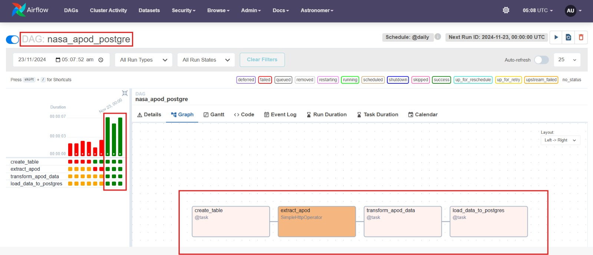

MLOps-ETL-Pipeline-using-AirFlow
================================

An end-to-end ETL pipeline for NASA APOD is implemented. 

This repo is directly connected with Astronomer to deploy automatically. 

**Note:** *This repo demonstrates the skill set working with Pipelines using AirFlow*.

