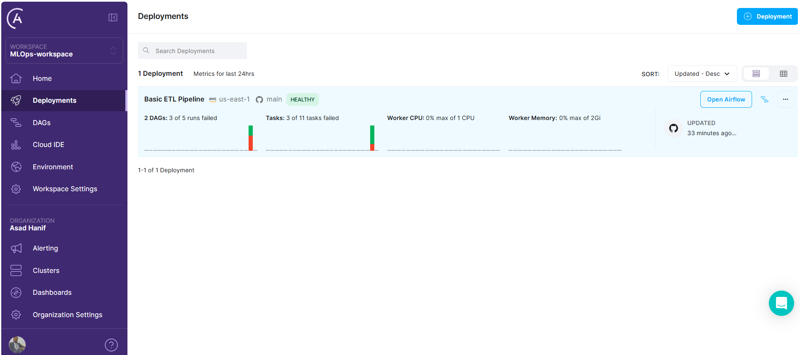

MLOps-ETL-Pipeline-using-AirFlow
================================

An end-to-end ETL pipeline for NASA APOD is implemented. 

This pipeline performs following steps:
1. Create the table if it doesn't exist 
2. Extract the NASA API Data (APOD)-Astronomy Picture of the Day
3. Transform the data (Pick the information that need to save)
4. Load the data into the PostgreSQL database

### Deployment at Astronomer 
To deploy the ETL pipeline we are using hosted AirFlow service offered by Astronomer. We need to create a deployment at Astronomer as shown below. 

After clicking any deployment, we can see details of this deployment. There is a button, i.e. `Open AirFlow`, to see the dashboard of AirFlow. 

Dashboard of our ETL pipeline looks like as following. 

This pipeline is storing/loading the data to an hosted Postgres DB offered by Neon platform.

This repo is directly connected with Astronomer to deploy automatically. 

**Note:** *This repo demonstrates the skill set working with Pipelines using AirFlow*.

